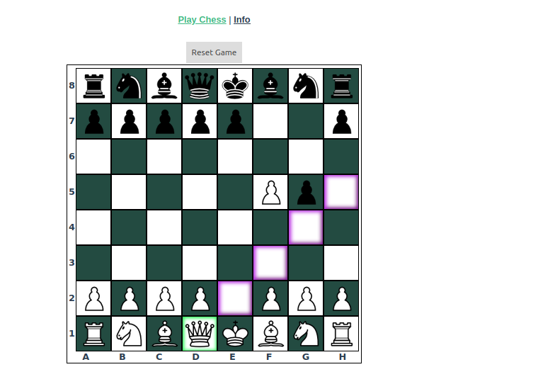

# vue-js-chess

Simple Chess Game implemented in Vue. Features include: 
* vuex store to hold state of game
* valid moves calculated on piece select and highlighted on board
* 2 player game play
* pieces move according to chess rules
* program prevents you from putting yourself in check
* program notifies upon checkmate

Known limitations: 
* Pawn promotion not implemented

## screen shot


## Project setup
```
npm install
```

### Compiles and hot-reloads for development
```
npm run serve
```

### Compiles and minifies for production
```
npm run build
```

### Run your unit tests
```
npm run test:unit
```

### Run your end-to-end tests
```
npm run test:e2e
```

### Lints and fixes files
```
npm run lint
```

### Customize configuration
See [Configuration Reference](https://cli.vuejs.org/config/).
